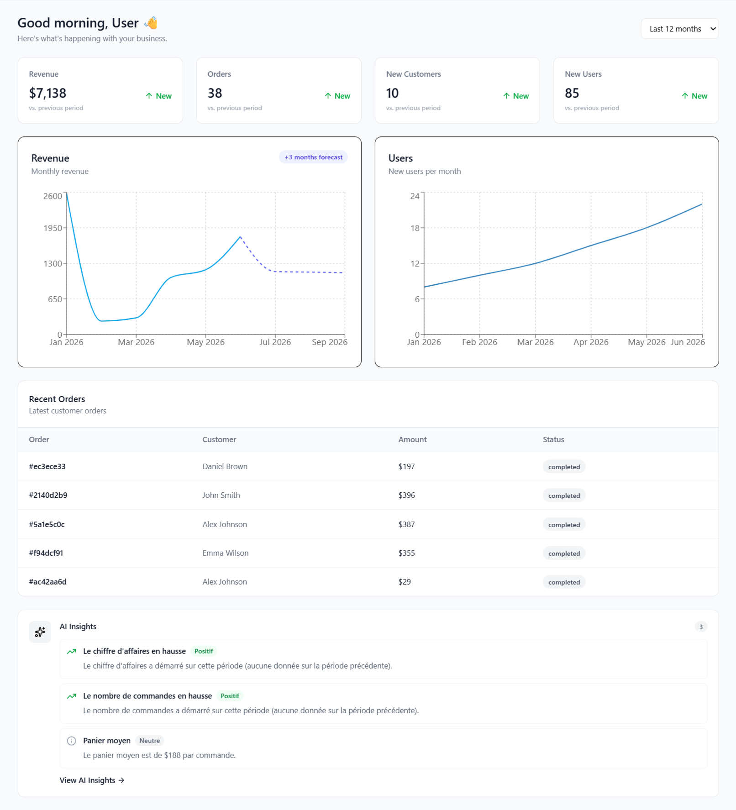
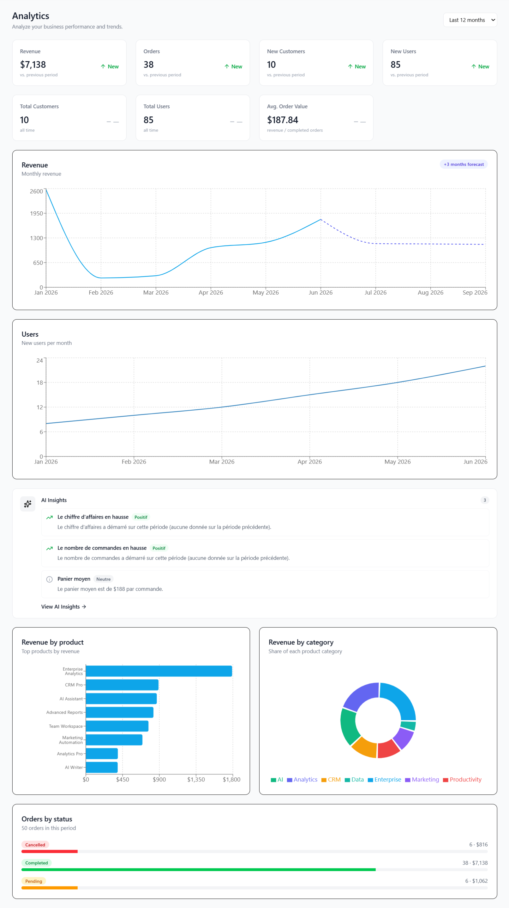
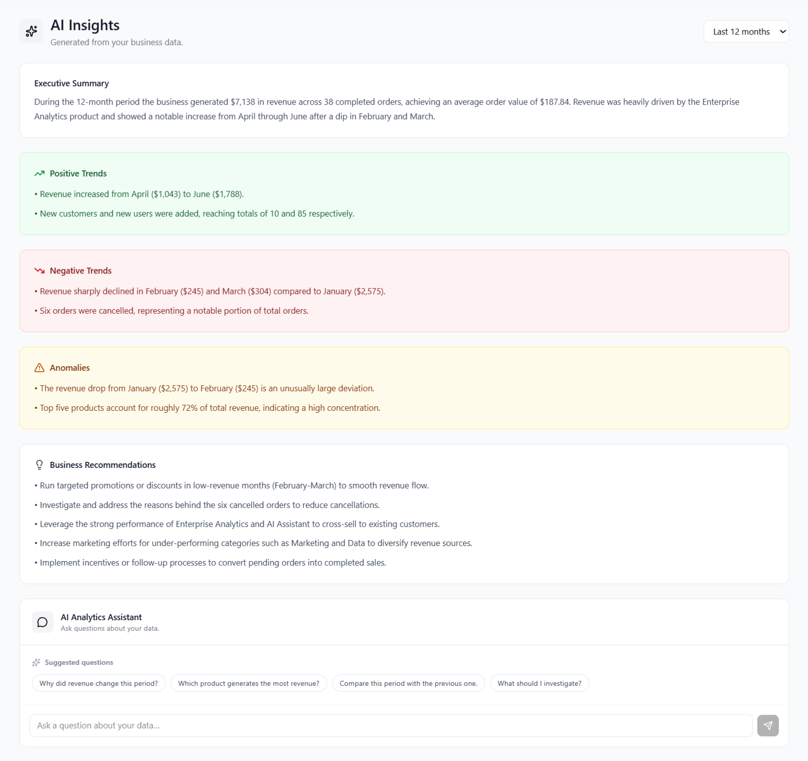
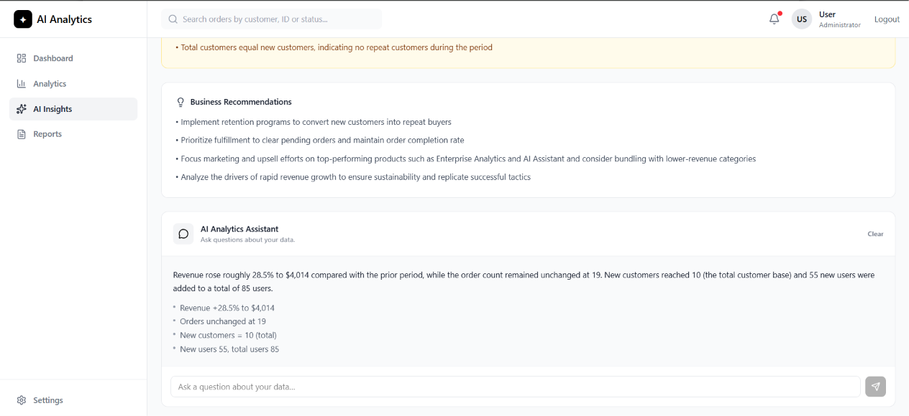

# AI-Powered Analytics Dashboard

A multi-tenant SaaS analytics dashboard that transforms raw business data into actionable, AI-generated insights.

Built with **React 19**, **TypeScript**, **Supabase**, **PostgreSQL**, and **Groq (Llama)**.

[](https://react.dev)
[](https://www.typescriptlang.org)
[](https://supabase.com)
[](https://tailwindcss.com)
[](./LICENSE)



---

## 📖 Table of Contents

- [Overview](#-overview)
- [Features](#-features)
- [Tech Stack](#️-tech-stack)
- [Architecture](#️-architecture)
- [Screenshots](#-screenshots)
- [🚀 Local Setup](#-local-setup)
  - [Prerequisites](#prerequisites)
  - [Step 1 — Clone and install](#step-1--clone-and-install)
  - [Step 2 — Create a Supabase project](#step-2--create-a-supabase-project)
  - [Step 3 — Run the SQL scripts](#step-3--run-the-sql-scripts)
  - [Step 4 — Configure environment variables](#step-4--configure-environment-variables)
  - [Step 5 — Configure Supabase Auth](#step-5--configure-supabase-auth)
  - [Step 6 — Set up the AI Edge Functions](#step-6--set-up-the-ai-edge-functions)
  - [Step 7 — Start the app and register](#step-7--start-the-app-and-register)
  - [Step 8 — Load demo data (optional)](#step-8--load-demo-data-optional)
- [Database Schema](#️-database-schema)
- [Security](#-security)
- [AI Architecture](#-ai-architecture)
- [Scripts](#-scripts)
- [Deployment](#-deployment)
- [Troubleshooting](#-troubleshooting)
- [Future Improvements](#-future-improvements)
- [Author](#-author)

---

## 🎯 Overview

**AI-Powered Analytics Dashboard** is a full-stack SaaS application that lets a company connect its business data and understand:

- **What is happening** — Dashboard with KPIs, trends, and recent orders
- **Why it is happening** — Analytics with breakdowns by product, category, and status
- **What to do about it** — AI Insights with summaries, anomalies, and recommendations
- **Ask anything** — AI Assistant for conversational Q&A on your data

It demonstrates a production-grade architecture: **multi-tenancy**, **RLS**, **PostgreSQL RPC**, **custom hooks**, **clean component design**, and **secure AI integration**.

---

## ✨ Features

### 🔐 Authentication & Multi-tenancy
- Register, login, logout, session persistence
- Email confirmation flow
- Every user belongs to a **company**; all business data is isolated by `company_id`
- **Row Level Security (RLS)** enforced on all tables

### 📊 Dashboard
- 4 KPI cards: **Revenue**, **Orders**, **New Customers**, **New Users**
- Previous-period comparison (up / down / neutral, with `null` when no data)
- Revenue trend chart with **forecast** (linear regression)
- Users growth chart
- Recent orders table with **search**
- AI Insight preview

### 📈 Analytics
- 7 KPI cards: the 4 above + **Total Customers**, **Total Users**, **Average Order Value**
- Revenue trend + forecast
- Revenue by product (top 8)
- Revenue by category (pie chart)
- Orders by status (completed / pending / cancelled)

### 🤖 AI
- **AI Insights**: Executive Summary, Positive Trends, Negative Trends, Anomalies, Recommendations
- **AI Assistant**: conversational chat to ask questions like *"Why did revenue change this period?"*
- **Fallback**: if the AI is unavailable, rule-based insights are displayed instead

### 📄 Reports
- 4 CSV exports: Revenue, Revenue by Product, Revenue by Category, Orders by Status

### ⚙️ Settings
- Update profile (full name)
- Update company (name, industry)
- Logout

### 📱 UI/UX
- Fully responsive (desktop / tablet / mobile)
- Loading skeletons
- Empty, error, and success states on all pages
- Accessible (semantic HTML, labels, aria attributes, keyboard navigation)

---

## 🛠️ Tech Stack

| Layer | Technology |
|-------|------------|
| **Frontend** | React 19, TypeScript, Vite 8 |
| **Styling** | Tailwind CSS v4 |
| **Routing** | React Router v7 |
| **Charts** | Recharts |
| **Icons** | Lucide React |
| **Dates** | date-fns |
| **Backend** | Supabase (Auth, PostgreSQL, RLS, Edge Functions) |
| **AI** | Groq API (`openai/gpt-oss-120b`) |
| **Deployment** | Vercel |

---

## 🏗️ Architecture

```
React UI
   ↓
Custom Hooks       (useAnalytics, useAiInsights, useAiAssistant)
   ↓
Services           (analyticsService, aiService, authService, companyService)
   ↓
Supabase Client
   ↓
PostgreSQL + RPC + RLS
   ↓
Edge Functions     (ai-insights, ai-assistant)  →  Groq API
```

```
src/
├── components/
│   ├── ai/                 # AssistantChat
│   ├── analytics/          # AnalyticsStats, OrdersByStatus
│   ├── charts/             # Revenue, Users, RevenueByProduct/Category
│   ├── dashboard/          # StatsGrid, StatCard, RecentOrders, AIInsightCard
│   ├── insights/           # InsightItem
│   └── ui/                 # Skeleton variants
├── context/                # AuthContext, AuthContextValue, useAuth
├── hooks/                  # useAnalytics, useAnalyticsBreakdowns, useAiInsights, useAiAssistant
├── layouts/                # DashboardLayout
├── lib/                    # supabaseClient
├── pages/                  # Dashboard, Analytics, AIInsights, Reports, Settings, Login, Register, NotFound
├── services/               # analyticsService, aiService, authService, companyService, insightsService
├── types/                  # analytics, ai, insights, dateRange
└── utils/                  # dateUtils, csvUtils, userUtils, aiContextUtils, orderStatusStyles
```

---

## 📸 Screenshots

| Dashboard | Analytics |
|-----------|-----------|
|  |  |

| AI Insights | AI Assistant |
|-------------|--------------|
|  |  |

---

## 🚀 Local Setup

This guide walks you through setting up **your own Supabase project** so the app runs entirely with your data.

> ℹ️ **Estimated time:** 10–15 minutes.

### Prerequisites

Before you start, make sure you have:

- **Node.js** v18 or higher — [download](https://nodejs.org)
- **npm** (comes with Node.js)
- A free **Supabase** account — [signup](https://supabase.com)
- A free **Groq** API key — [console.groq.com](https://console.groq.com)
- **Supabase CLI** (installed in Step 6)

---

### Step 1 — Clone and install

```bash
git clone https://github.com/Mouad-El-Aouiz/ai-analytics-dashboard.git
cd ai-analytics-dashboard
npm install
```

---

### Step 2 — Create a Supabase project

1. Go to [supabase.com/dashboard](https://supabase.com/dashboard)
2. Click **New Project**
3. Choose a name, a database password, and a region close to you
4. Wait ~2 minutes for the project to be ready
5. Open **Settings → API** and note:
   - **Project URL** — looks like `https://xxxxx.supabase.co`
   - **Publishable Key** (or **anon key** on older projects) — a long string starting with `eyJ...` or `sb_publishable_...`
6. Open **Settings → General** and note:
   - **Reference ID** — visible in the URL: `https://supabase.com/dashboard/project/<REF>`

> ℹ️ **Publishable vs anon key:** Supabase recently renamed the "anon" key to "Publishable key". They are the same thing. If your project shows "anon", use it. Both are safe to expose in the frontend.

---

### Step 3 — Run the SQL scripts

In your Supabase project, open the **SQL Editor** (left sidebar) and run these files **in this exact order**.

Copy the content of each file from the repo and paste it into the SQL Editor, then click **Run**.

| # | File | Purpose |
|---|------|---------|
| 1 | `supabase/schema.sql` | Creates all tables |
| 2 | `supabase/rls.sql` | Enables Row Level Security |
| 3 | `supabase/functions.sql` | Creates RPC functions and the signup trigger |

> ⚠️ **Do NOT run `seed.sql` yet.** It must be run **after** you create an account in Step 7.

---

### Step 4 — Configure environment variables

At the root of the project, copy the example file:

```bash
cp .env.example .env
```

Open `.env` and fill in your Supabase credentials from Step 2:

```env
VITE_SUPABASE_URL=https://YOUR-PROJECT-REF.supabase.co
VITE_SUPABASE_PUBLISHABLE_KEY=YOUR_PUBLISHABLE_KEY
```

> ℹ️ These two variables are **safe to expose** in the frontend. Your data is protected by Row Level Security.

---

### Step 5 — Configure Supabase Auth

Your app uses email confirmation. By default, Supabase requires users to click a link in their inbox before they can log in.

In your Supabase project, go to **Authentication → URL Configuration**:

- **Site URL**: `http://localhost:5173`
- **Redirect URLs**: add `http://localhost:5173/**`

Then, go to **Authentication → Providers → Email**:

- Make sure **Email** is enabled
- Leave **"Confirm email"** enabled (this is the default)

> ℹ️ **About email confirmation:** After registering, you will receive a confirmation email. Click the link inside it, then you can log in. If you want to skip this during testing, you can temporarily disable **"Confirm email"** in the same page — but remember to re-enable it for production.

---

### Step 6 — Set up the AI Edge Functions

The AI features (Insights + Assistant) run in **Supabase Edge Functions**, which call the **Groq API**. The Groq API key is stored as a secret on Supabase and never exposed to the browser.

#### 6.1 Install the Supabase CLI

```bash
npm install -g supabase
```

#### 6.2 Log in and link your project

```bash
supabase login
supabase link --project-ref YOUR-PROJECT-REF
```

- `supabase login` opens a browser window to authenticate.
- `supabase link` asks for your **database password** (the one you set in Step 2).

#### 6.3 Get a Groq API key

1. Go to [console.groq.com](https://console.groq.com)
2. Sign up (free)
3. Go to **API Keys → Create API Key**
4. Copy the key (it starts with `gsk_...`)

#### 6.4 Store the secret in Supabase

```bash
supabase secrets set GROQ_API_KEY=your_groq_api_key_here
```

#### 6.5 Deploy the Edge Functions

```bash
supabase functions deploy ai-insights
supabase functions deploy ai-assistant
```

> ℹ️ Each deployment takes 10–30 seconds. When it's done, you'll see a success message in the terminal.

---

### Step 7 — Start the app and register

```bash
npm run dev
```

Open [http://localhost:5173](http://localhost:5173) in your browser.

1. Click **Register**
2. Fill in your full name, email, and password
3. Submit — Supabase sends a **confirmation email**
4. Open your inbox, click the confirmation link
5. You are redirected to the app, logged in

> ℹ️ **If the confirmation email doesn't arrive:**
> - Check your spam folder
> - Wait 1–2 minutes
> - Or disable **"Confirm email"** in Supabase (Step 5) and register again

You will now see the **Dashboard**, but with **no data yet** (all KPIs at 0).

---

### Step 8 — Load demo data (optional)

To see the dashboard, charts, and AI features in action, load the demo seed.

In your Supabase **SQL Editor**, open `supabase/seed.sql` and run it.

This script:
- Picks the **first company** in the database (yours, created at registration)
- Inserts 10 customers, 8 products, 85 users, and 12 months of orders
- Is **idempotent** — running it twice won't duplicate data

After running it, go back to your app and **refresh the page**. You should now see:
- KPIs populated with real numbers
- Charts with trends
- AI Insights generated by Groq

> ⚠️ **If you see "No company found" in the SQL output**, it means you haven't registered yet. Complete Step 7 first, then run the seed again.

---

## 🗄️ Database Schema

### Tables

| Table | Purpose |
|-------|---------|
| `companies` | One per signup. Owns all business data. |
| `profiles` | Links `auth.users` to a `company_id`. |
| `products` | Products sold by the company. |
| `customers` | Company's customers. |
| `users` | End-users of the company's product (not dashboard users). |
| `orders` | Orders with status (`pending`, `completed`, `cancelled`). |
| `order_items` | Line items of each order. |
| `ai_insights` | Cached AI insights (optional). |

### Metric definitions

| Metric | Definition |
|--------|------------|
| **Revenue** | Sum of `total_amount` for `completed` orders |
| **Orders** | Count of `completed` orders |
| **New Customers** | Customers created in the period |
| **Total Customers** | All customers of the company |
| **New Users** | Users created in the period |
| **Total Users** | All users of the company |
| **Average Order Value** | Revenue / Orders (completed) |

### RPC functions

- `get_total_revenue(company_id, start, end)`
- `get_monthly_revenue(company_id, start)`
- `get_monthly_users(company_id, start)`
- `get_orders_by_status(company_id, start)`
- `get_revenue_by_product(company_id, start)`
- `get_revenue_by_category(company_id, start)`
- `get_total_customers(company_id)`
- `get_total_users(company_id)`

All RPC use `SECURITY INVOKER` so RLS still applies.

---

## 🔒 Security

- ✅ **RLS enabled** on every table
- ✅ **Company isolation** via `company_id` on every business table
- ✅ **Column-level protection**: `profiles.company_id` is not user-updatable
- ✅ **No service-role key** in the frontend
- ✅ **No AI API key** in the frontend — calls go through Supabase Edge Functions
- ✅ **CORS** configured on Edge Functions
- ✅ **Secrets** stored in Supabase, never committed

---

## 🤖 AI Architecture

```
React (AIInsights.tsx, AssistantChat.tsx)
   ↓
aiService.ts  (supabase.functions.invoke)
   ↓
Supabase Edge Function  (ai-insights / ai-assistant)
   ↓
Groq API  (openai/gpt-oss-120b)
```

- The **Groq API key** stays server-side in Supabase Secrets
- **Compact context**: only a summary JSON is sent (never the whole database)
- **Fallback**: if Groq is unavailable, `insightsService.ts` produces deterministic rule-based insights
- **Validation**: response shape is validated before being used in the UI

---

## 📜 Scripts

```bash
npm run dev       # Start dev server (http://localhost:5173)
npm run build     # Production build
npm run lint      # ESLint
npm run preview   # Preview production build
```

---

## 🚢 Deployment (Vercel)

1. Push your repo to GitHub
2. Import it on [vercel.com/new](https://vercel.com/new)
3. Add environment variables:
   - `VITE_SUPABASE_URL`
   - `VITE_SUPABASE_PUBLISHABLE_KEY`
4. Update Supabase **Auth → URL Configuration** with your Vercel domain:
   - **Site URL**: `https://your-app.vercel.app`
   - **Redirect URLs**: add `https://your-app.vercel.app/**`
5. Deploy

---

## 🐛 Troubleshooting

### "No company found" when running `seed.sql`

You haven't registered yet. Complete **Step 7** first (create an account in the app), then run the seed again.

### "Email not confirmed" when trying to log in

Supabase requires email confirmation by default. Either:
- Click the link in the confirmation email
- Or temporarily disable **"Confirm email"** in Supabase (Authentication → Providers → Email)

### "Missing VITE_SUPABASE_URL" in the console

Your `.env` file is missing or empty. Re-do **Step 4** and restart `npm run dev`.

### AI Insights shows "AI insights are currently unavailable"

This means the Edge Function could not reach Groq. Check:
1. `GROQ_API_KEY` is set: `supabase secrets list`
2. Edge Functions are deployed: `supabase functions list`
3. Your Groq account still has quota left: [console.groq.com](https://console.groq.com)

### `supabase link` asks for a database password

Use the password you set when creating the Supabase project in **Step 2**. If you forgot it, you can reset it in **Settings → Database → Reset database password**.

### CORS error when calling the Edge Functions

Make sure the Edge Functions were deployed **after** your project was linked. Re-run:
```bash
supabase functions deploy ai-insights
supabase functions deploy ai-assistant
```

### The forecast shows "+3 months" but no dashed line

The forecast requires **at least 2 months of data**. Run `seed.sql` (Step 8) or wait until your account has more history.

---

## 🔮 Future Improvements

- [ ] Unit tests with Vitest
- [ ] PDF export for reports
- [ ] Avatar upload (Supabase Storage)
- [ ] Password reset flow
- [ ] Notifications system
- [ ] Dark mode
- [ ] Multi-language (i18n)
- [ ] Supabase generated types (`database.types.ts`)

---

## 📄 License

MIT — feel free to use this project as a learning reference.

---

## 👤 Author

**Mouad El Aouiz**
- GitHub: [@Mouad-El-Aouiz](https://github.com/Mouad-El-Aouiz)
- LinkedIn: [mouad-el-aouiz](https://www.linkedin.com/in/mouad-el-aouiz/)

---

## 🙏 Acknowledgments

- [Supabase](https://supabase.com) — backend, auth, RPC, edge functions
- [Groq](https://groq.com) — fast AI inference
- [Recharts](https://recharts.org) — charts
- [Lucide](https://lucide.dev) — icons
- [Tailwind CSS](https://tailwindcss.com) — styling